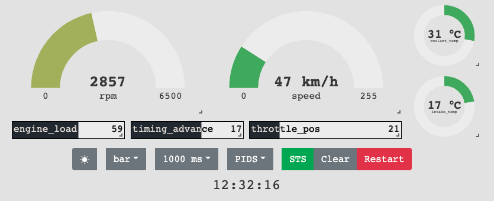
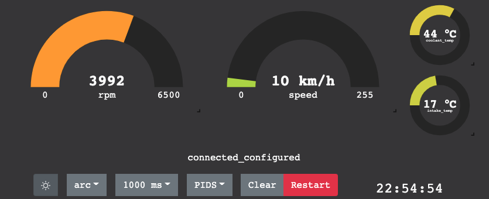
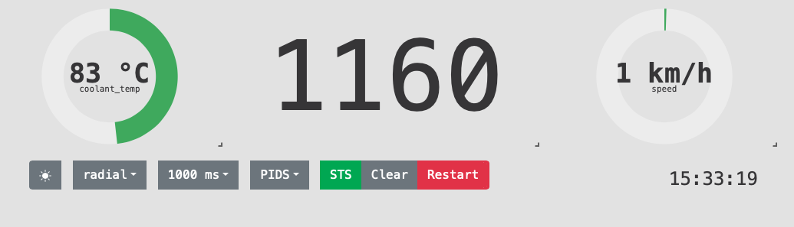
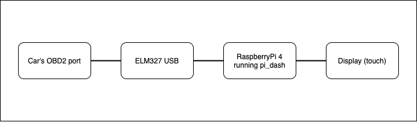

[](https://github.com/pay64k/pi_dash/actions/workflows/tests.yml)

# pi_dash - automotive (rally) dash written in Elixir and React that runs on Raspberry Pi





pi_dash is an application that can replace your cars standard gauges with customizable dashboard where you can choose which reading you would like to see.

The reason this project came to life is that my amateur rally car was lacking a tachometer, coolant temperature etc gauges, which would be quite helpful in extreme rally conditions.

In the beginning I only wanted to make a simple tachometer, but then decided to go full in and came up with this.

### **Note:**
The project is still in development and was tested only on several cars. 
#

## Features
* Automatically finds and configures ELM device
* Currently supported OBD PIDs:
    * RPM
    * Vehicle speed
    * Intake temp
    * Throttle position
    * Timing advance
    * Engine load
    * Coolant temp
* Selectable intervals for data collection
* Light and night mode GUI
* Draggable and resizable gauges
* Selections of gauges and layout are not lost upon restart
* User configurable max RPM range
## High level overview


You can run the software from you computer first to see how it works with your car.

## Installation
Untar the latest release to `/home/$USER/`. From `/home/$USER/pi_dash/bin/`, run:
```
./pi_dash start
```
or
```
./pi_dash daemon
```
for detached mode.

## Configuration
Custom configuration parameters are located in
```
/home/$USER/pi_dash/releases/x.x.x/env.sh
```
### Run on specific serial port
If pi_dash doesn't find a supported ELM device to connect to it will try on specific serial port. If your ELM device is not supported (e.g. does not auto-detect) you can edit the `env.sh` file and change `SERIAL_PORT` environment variable to you port, for example:
```
export SERIAL_PORT="/dev/pts/2"
```
### Max RPM (default 6500)
Since all cars are different it is possible to set your own value for maximum RPM your engine can have.
In `env.sh` change the value to match your car:
```
export MAX_RPM=6500
```
### Debug logs
For problems reporting and debugging in "production" you can change `LOG_LEVEL` variable to debug:
```
export LOG_LEVEL=debug
```
In order to see extra stuff like how the message is decoded and what are the translated values, change this to true:
```
export EXTRA_LOGGING=true
```
*Note:*

`EXTRA_LOGGING=true` will only take place if `LOG_LEVEL` is set to `debug`

If you change any values in `env.sh`, you need to restart the application with:
```
./home/$USER/pi_dash/bin/pi_dash stop
./home/$USER/pi_dash/bin/pi_dash daemon
```
or reboot your Raspberry Pi.

### Raspberry Pi configuration
[OS installation](https://desertbot.io/blog/headless-raspberry-pi-4-ssh-wifi-setup)

[Chromium in kiosk mode and autostart](https://desertbot.io/blog/raspberry-pi-4-touchscreen-kiosk-setup)
### Autostart application
After following instructions in [Chromium in kiosk mode and autostart](https://desertbot.io/blog/raspberry-pi-4-touchscreen-kiosk-setup) edit `sudo nano /etc/xdg/openbox/autostart` and add one line to start `pi_dash` on boot:
```
/home/$USER/pi_dash/bin/pi_dash daemon
```
### Hibernate mode (car engine off)
TBD
## Development mode
Install [ELM327-emulator](https://github.com/Ircama/ELM327-emulator) and run with `python3 -m elm`, then run command `scenario car`. Note the serial port and change it in `config.exs`. Run `make test_mode`, in browser open `localhost:4000`.

## Building from main
Since the target platform is Raspberry Pi the application has to be built with that architecture in mind. I've tried to use `docker buildx`, but so far didn't succeed.


You can fork this repo, install GitHub's `action-runner` and use `.github/workflows/build_on_rpi4.yml` to build it on your own RPi4.

Before running the workflow, do the following:
1. label your runner as `rpi4`
2. on RPi you need to install 3 packages. I recommend using [asdf](https://asdf-vm.com/#/core-manage-asdf). You will need [Erlang](https://github.com/asdf-vm/asdf-erlang) and [Elixir](https://github.com/asdf-vm/asdf-elixir.git) as well as [nodejs](https://github.com/asdf-vm/asdf-nodejs).

TODO:
* [ ] Hibernate RPi when the car engine is off (or by external button flip)
* [ ] Handle reconnect when engine is off
* [x] Longer tests with car to test stability of the application, deadlocks etc
* [x] Add support for ELM devices from different manufacturers
* [x] Enhance GUI: support for different gauge types. Make it more flashy? Add theme support?
* [ ] Create `img` file with all above configuration ready to burn on SD card for RPi, [guide](https://medium.com/platformer-blog/creating-a-custom-raspbian-os-image-for-production-3fcb43ff3630) or can Nerves do the same?