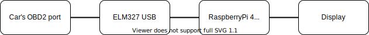

# pi_dash - automotive (rally) dash written in Elixir and React that runs on Raspberry Pi

pi_dash is an application that can replace your cars standard gauges with customizable dashboard where you can choose which reading you would like to see. 

The reason this project came to life is that my amateur rally car was lacking a tachometer, coolant temperature etc gauges, which would be quite helpful in extreme rally conditions. 

In the beginning I only wanted to make a simple tachometer, but then decided to go full in and came up with this.

## **Note:** The project is still in development and was tested only on several cars. Since I am not a design expert the GUI would use some enhancements - but for now it's the simplest working solution.

#

## High level overview

pi_dash is based an Phoenix server that runs on Ra

## Application
Teoretically any car with OBD2 port should be able to use this

https://www.csselectronics.com/screen/page/simple-intro-obd2-explained/language/en, "Raw OBD2 frame details" chapter

OBD codes: https://en.wikipedia.org/wiki/OBD-II_PIDs#Service_01

https://python-obd.readthedocs.io/en/latest/Command%20Tables/

elm emulator: https://github.com/Ircama/ELM327-emulator
switch to car, after running `elm` - `scenario car`

progress bar: https://loading.io/progress/

draw here: https://www.drawsvg.org/drawsvg.html and convert here: https://editor.method.ac/

elm commands: https://www.elmelectronics.com/wp-content/uploads/2016/07/ELM327DS.pdf

https://medium.com/@artur.klauser/building-multi-architecture-docker-images-with-buildx-27d80f7e2408

docker run --rm --privileged multiarch/qemu-user-static --reset -p yes

https://www.pi-shop.ch/5-inch-capacitive-touch-screen-800x480-hdmi-monitor-tft-lcd-display-fuer-raspberry-pi
framebuffer_width=800 
framebuffer_height=480 
hdmi_force_hotplug=1 
hdmi_group=2 
hdmi_mode=87 
hdmi_cvt  800  480  60  6  0  0  0 

https://desertbot.io/blog/headless-raspberry-pi-4-ssh-wifi-setup
https://desertbot.io/blog/raspberry-pi-4-touchscreen-kiosk-setup
install lightdm
change raspi-config to autologin to dektop

https://asdf-vm.com/#/core-manage-asdf
https://github.com/asdf-vm/asdf-erlang
    sudo apt-get install -y libssl-dev libncurses5-dev
https://github.com/asdf-vm/asdf-elixirasdf plugin-add elixir https://github.com/asdf-vm/asdf-elixir.git
https://github.com/asdf-vm/asdf-nodejs

install hex
mix local.rebar --force

add react to phoenix https://dewetblomerus.com/2018/11/30/react-on-phoenix-1-4.html
